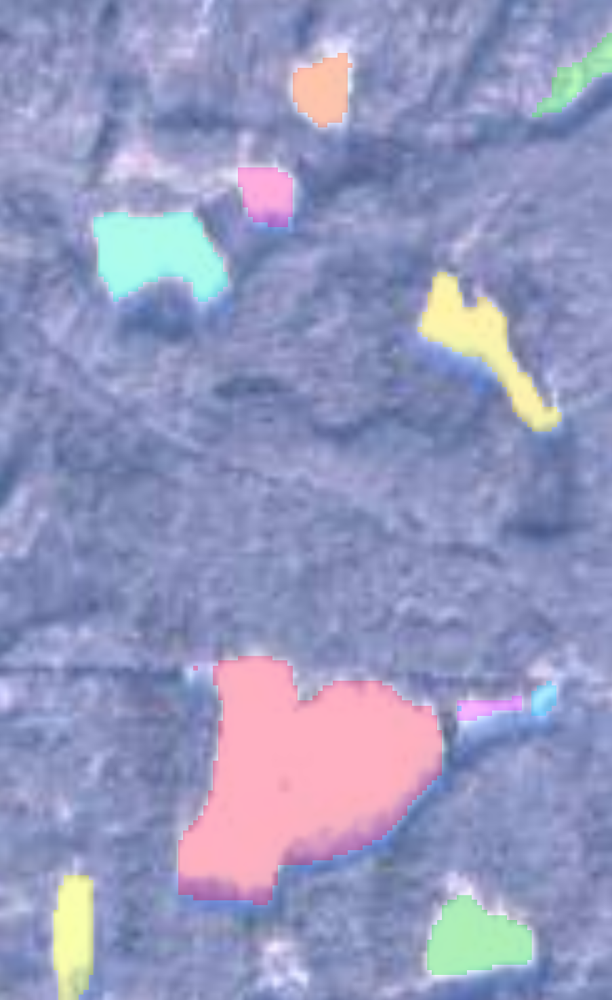
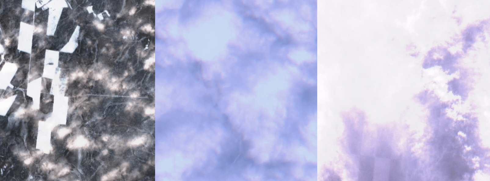
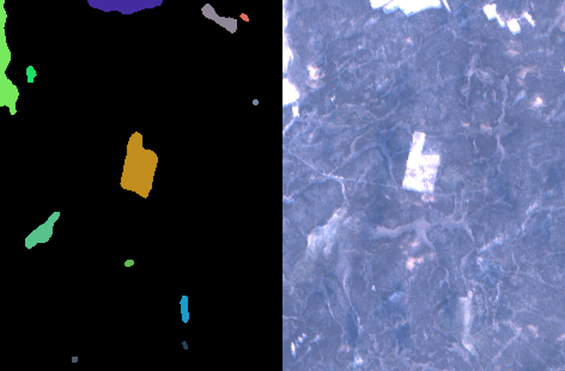
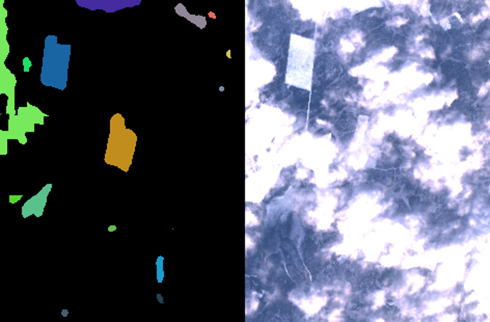
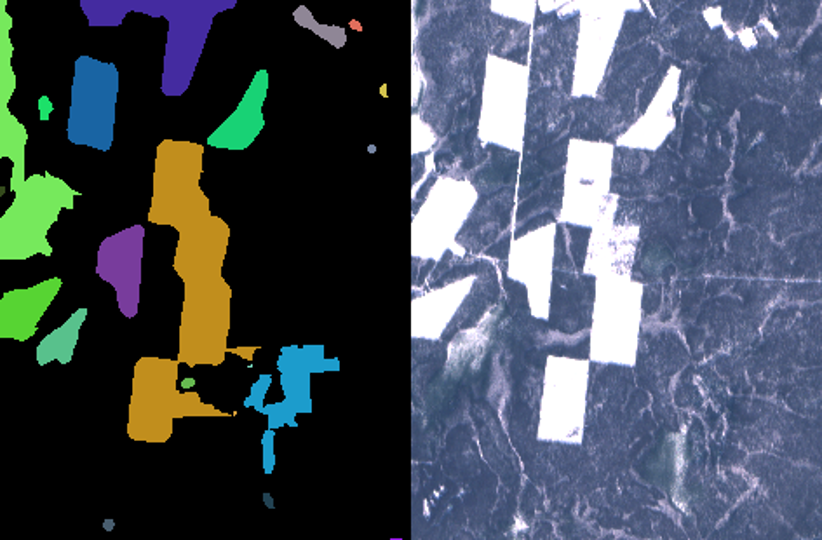

# Forest Guard CLI

Check our website for **documentation** and more info - **https://forestguardian.ru/**.
Forest Guard CLI using Click framework.

# About

Our goal is to look for deforestation area and track them in time period on satellite images. For example:



We tried to use unsupervised and supervised learning on this problem and got two best algorithms:
1. K-Means
2. U-Net model

Of course we are taking information from date of photos (It takes a long time for a forest to grow back).
The main problem are clouds and "even human can't be 100% sure if this pixel is forest or deforestation".



## Data

We download data from Sentinel Hub (https://www.sentinel-hub.com). We work only with L1C and L2A satellites. You need API token for this.

## Preparation

Use venv!
- [ ] Install requirements using this command:
```bash
pip install -r requirements/dev.txt
```
- [ ] Wake the `setup.py` up:
```bash
pip install .
```
This will give you the opportunity to use `fguard`.

## Usage

- Add credentials to a programm:
```bash
fguard config [–f “path/to/config/settings.toml”] | [--id “YOUR_ID” --token “YOUR_TOKEN”]
```
- Request:
```bash
fguard request [–f “path/to/config/settings.toml”] | [-c  c1 c2 c3 c4 -t t1 t2] “output/folder” {-s "size" –d "detector" --isolate}
```
This will save images in output folder. Also saves json files of all events (new, add, merge).
- Erase cache, config file, etc:
```bash
fguard delete [--cache] | [--config] | [--model]
```
- To use `net` detector you need to download model:
```bash
fguard net --update
```
It can be also used to update model (we still train it).


For more info check our website - **https://forestguardian.ru/**.

### Example of toml settings file

- `config-settings-example.toml`
```toml
[config]
id = ""
token = ""
```
- `request-settings-example.toml`
```toml
coordinates = [ 42.65614, 59.58242, 42.73579, 5952529 ]
time = [ "2017.12.01", "2023.02.28" ]
```

## Some images on what program gives as a result




