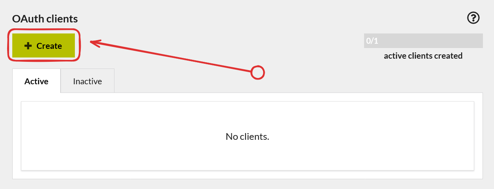
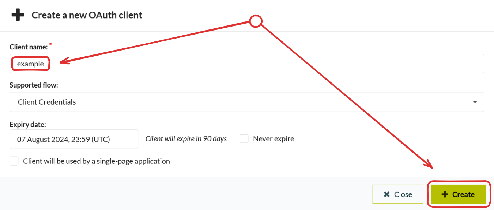
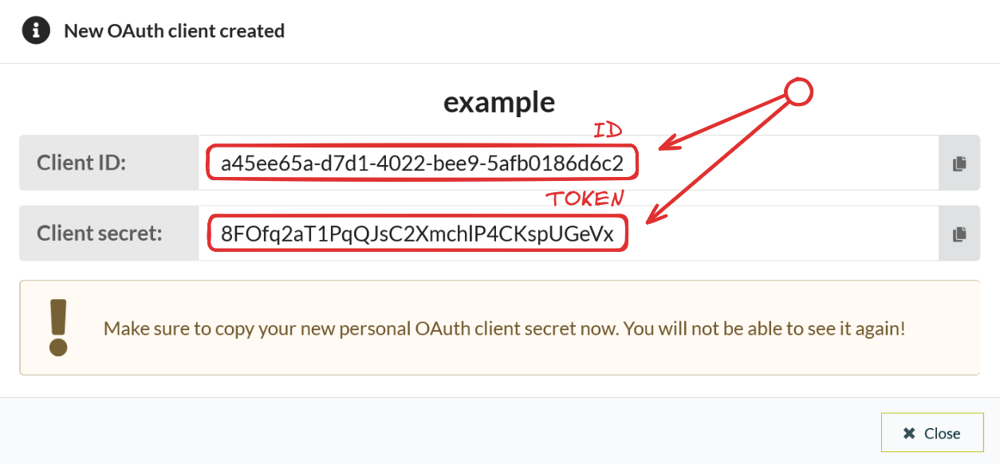
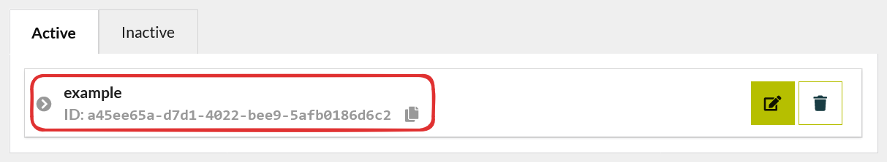

# ⚙ Configuration
In this section we will make possible downloading satellite data.
## Getting API credentials
1. Go to [**dashboard account settings**](https://apps.sentinel-hub.com/dashboard/#/account/settings) 
:::info
If you don't have Sentinel Hub account, [**sign up**](https://www.sentinel-hub.com).
:::
3. Press `Create` button in `OAuth clients` section.



5. Choose a client name and press the `Create` button again.



7. Save `ID` and `TOKEN` (this is the only data we need).



:::danger
You will never be able to view your token again. Make sure you saved it.
:::

8. Now in the settings you can see that we created credentials successfully.


## Providing credentials
:::info
This part is only for those who want to change credentials or didn't configure `fguard` before.
:::

Next step is telling `fguard` **ID** and **TOKEN**. You can do it in two ways. 
### Inline providing
Just run:
```bash
fguard config --id "<ID>" --token "<TOKEN>"
```
### Using settings file
You need to create `settings.toml` file:
```toml
[config]
id = "<ID>"
token = "<TOKEN>"
```
After that run:
```bash
fguard config --file "<path/to/settings.toml>"
```
Now you are ready to create your first request.