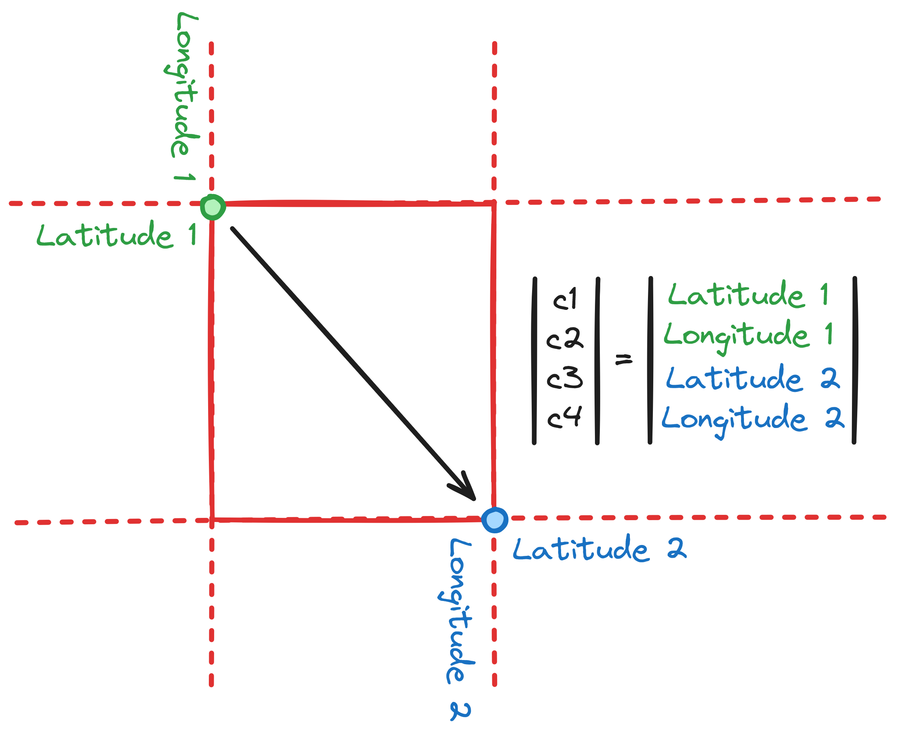
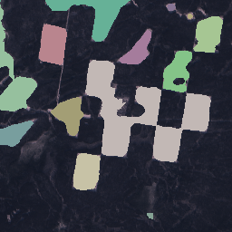

# 🛰 Request
In this section we will finally get images with detected deforestation.
## Required arguments and parameters
You need to always specify location of folder where you want to save output images:
```bash
fguard request ... "<path/to/output/folder>"
```
:::warning
While saving images to an output folder it removes **ALL DATA** in that folder (for guaranteed output images).
:::
Also `coordinates`, `time`, `detector` are required:
```bash
fguard request ... --coordinates c1 c2 c3 c4 --time from-date to-date ...
```
Where `c1`, `c2`, `c3` and `c4` are **WGS84** coordinates of the area:



:::tip
We recommend getting coordinates from this **[map](https://apps.sentinel-hub.com/eo-browser/)**.
:::

Where `from-date` and `to-date` are boundaries of the time period in dot format YYYY.MM.DD (inclusive).
:::note
Note that app finds images only in winter season.
:::
For example:

```bash
fguard request ... --coordinates 95.1 95.2 96.1 96.3 --time 2023.02.12 2023.06.01 "./output"
```
This command will detect deforestation on all winter days from February 12 to June 1 of 2023 year on the corresponding area and save images to `./output` folder.

:::note
You will get something like this (single image of the output group):


:::

:::info
Don't worry about your processing units! Our app caches data.
:::
## Additional parameters
### Deforestation detector
`fguard` uses neural networks to detect deforestation by default, but you can specify what algorithm to execute:
```bash
fguard request ... --detector "<DETECTOR>" ...
```
Where `<DETECTOR>` can be:
- `net` (default) -> detect using U-Net (convolutional neural network).
- `cluster` -> detect using K-Means clustering.

:::warning
To use `net` detector you need to download pretrained model using this command:
```bash
fguard net --update
```
You can also use this to update local model (it is still in training).
:::

### Separate real images and masks

By default fguard saves masks over real images. To separate them, use `--isolate` flag:
```bash
fguard request ... --isolate ...
```

### Size

App download images in 256x256 shape but you can also change it:
```bash
fguard request ... --size width height ...
```

## Using settings file
:::info
It can be useful because you can store config and request data in the same place without need to specify coordinates, time periods, etc. every time.
:::
If you didn't create `settings.toml` file in the **Configuration** part, do it and write all same required or additional parameters that were in previous part, for example:
```toml
[request]
coordinates = [ 95.1, 95.2, 96.1, 96.3 ]
time = [ "2023.02.12", "2023.06.01" ]
detector = "cluster"
size = [ 300, 200 ]
```
If you wrote `ID` and `TOKEN` too, it will look like this:
```toml
[config]
id = "<ID>"
token = "<TOKEN>"
[request]
coordinates = [ 95.1, 95.2, 96.1, 96.3 ]
time = [ "2023.02.12", "2023.06.01" ]
detector = "cluster"
size = [ 300, 200 ]
```
After that run:
```bash
fguard request ... --file "<path/to/settings.toml>" "./output"
```
Don't forget to specify output folder. And optionally others flags too.
:::info
You can also use parameters while using settings file, it will overrides file parameters, for example, if you set `detector` in `settings.toml` to "cluster":
```bash
fguard request ... --detector "net" ...
```
It will use "net" detector, not "cluster".
:::